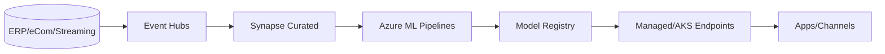

# Azure MLOps Blueprint (Enterprise)

End-to-end MLOps aligned with enterprise governance for scalable delivery.

- Data: Ingestion (ADF/Event Hubs), curated in Synapse Lakehouse/SQL, data contracts
- ML: Azure ML pipelines, model registry, managed endpoints; AKS for custom serving
- CI/CD: GitHub Actions/ADO; environments with policy gates and approvals
- IaC: Terraform/Bicep for repeatable platform setup (network, AML, AKS)
- Observability: data drift, model performance, logging/metrics/tracing

Mermaid (high-level):

Folders to include:
- infra/bicep or infra/terraform
- data/contracts
- aml/pipelines (Python SDK v2)
- serving/aks (FastAPI + k8s manifests)

