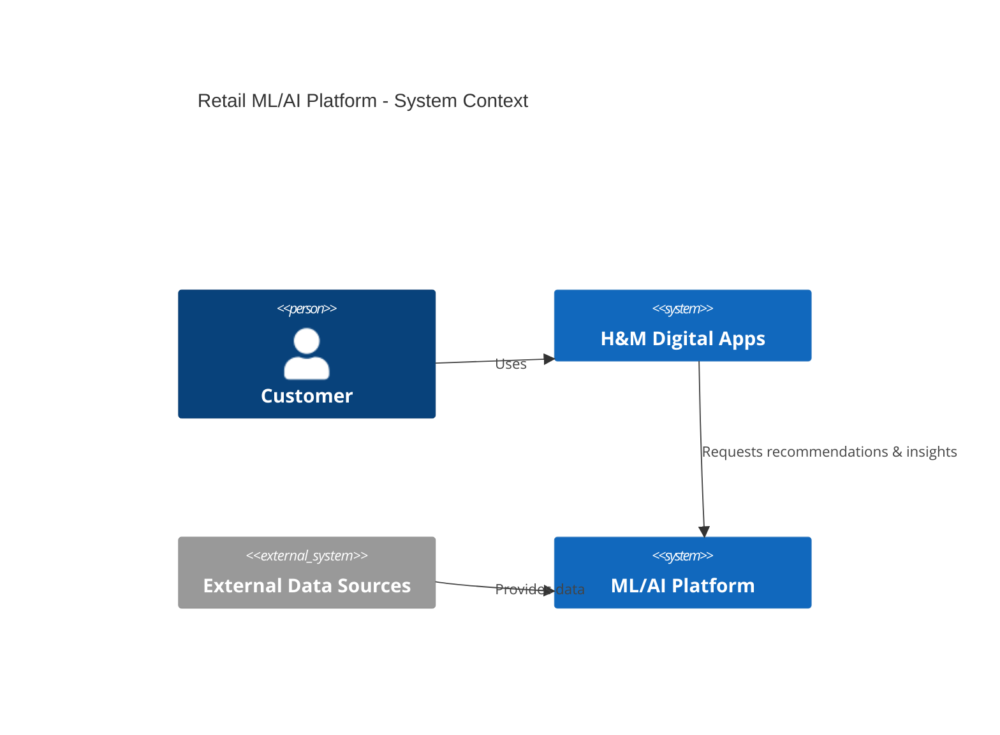
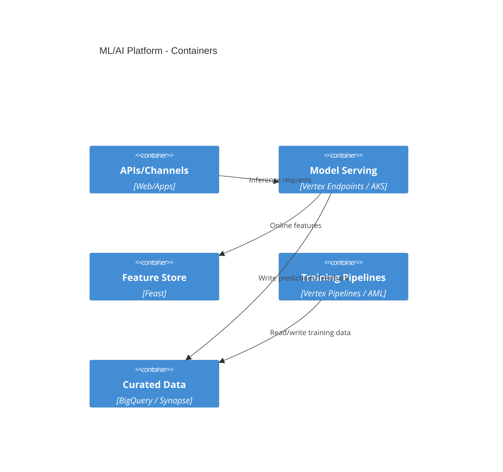

# C4 Diagrams (Mermaid)

System Context

```mermaid
C4Context
title Retail ML/AI Platform - System Context
Person(Customer, "Customer")
System(HMApps, "H&M Digital Apps")
System_Ext(ExternalData, "External Data Sources")
System(MLPlatform, "ML/AI Platform")
Rel(Customer, HMApps, "Uses")
Rel(HMApps, MLPlatform, "Requests recommendations & insights")
Rel(ExternalData, MLPlatform, "Provides data")
```

Container Diagram

```mermaid
C4Container
title ML/AI Platform - Containers
Container(Web, "APIs/Channels", "Web/Apps")
Container(Serving, "Model Serving", "Vertex Endpoints / AKS")
Container(Features, "Feature Store", "Feast")
Container(Training, "Training Pipelines", "Vertex Pipelines / AML")
Container(Data, "Curated Data", "BigQuery / Synapse")
Rel(Web, Serving, "Inference requests")
Rel(Serving, Features, "Online features")
Rel(Training, Data, "Read/write training data")
Rel(Serving, Data, "Write predictions/feedback")
```

